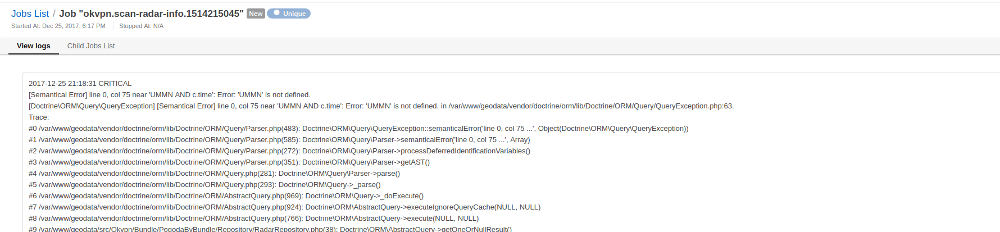

#  BetterOroBundle

This bundle provide bugfixes and new features for OroPlatform.

Table of Contents
-----------------
 - [Job logger](#job-logger)
 - [Change message priorities](#change-message-priorities)
 - [Message send events](#message-send-events)
 - [Dump not translated entities](#debug-entity-translations)
 - [Command for generate Oro bundle](#generate-bundle)
 - [Handle jobs exception](#handle-jobs-exception)
 - [Improve cron cleanup](#improve-cron-cleanup)
 - [Better log format](#better-log-format)
 - [Disable container reset extension](#disable-container-reset-extension)
 - [Calendar date duplicate](#calendar-date-duplicate)
 - [Disable outgoing network requests by OroCRM Request Form](#disable-orocrm-request-form)
 - [Fix order by timePeriod in DateGroupingFilter](#fix-order-by-the-time-period)
 - [Manual cron run](#cron-run-in-ui)
 - [Show datagrid exception if debug = true](./Datagrid/DataGridExtension.php#L27)

## Configurable capabilities

```yml
okvpn_better_oro:
    capabilities:
        mq_disable_container_reset: true #Disable container reset extension for performance
        mq_send_events: true #Dispatch sending events & overwrite message priority of queue processing
        mq_log_format: true #User frendly format of MQ logs in console (in tty console)
        cron_fix_cleanup: true #Fix cron definition load command
        job_logs: true #Display job output and errors in UI
        fix_calendar: true #Fix calendar days generator in ReportBunle 
```

### Job logger
The job logger provides the ability to display logs in the UI. Usage: inject logger `okvpn.jobs.logger` into your service

Example:

```php
class SomeProcessor implements MessageProcessorInterface
{

    /** @var LoggerInterface */
    private $logger;

    /** @var JobRunner */
    private $jobRunner;

    public function __construct(LoggerInterface $logger, JobRunner $jobRunner)
    {
        $this->logger = $logger;
        $this->jobRunner = $jobRunner;
    }
    
    /**
     * {@inheritdoc}
     */
    public function process(MessageInterface $message, SessionInterface $session)
    {
        $body = JSON::decode($message->getBody());

        $result = $this->jobRunner->runDelayed(
            $body['jobId'],
            function () use ($body) {
                try {
                    $this->logger->info('This logs will display in UI on the given root jobs page.')
                } catch (\Throwable $e) {
                    $this->logger->critical(
                        'An error occupies during job execute'
                        ['e' => $e,] // the full stack trace & exception message will display on the job page.
                    );

                    return false;
                }
            }
        );
        
        $this->logger->info('This log will not display, because there isn\'t active job');
        
        return $result ? self::ACK : self::REJECT;
    }
}

```

#### Execute jobs in active transaction

The log persistence happen in a separate transaction from the process that executes it, so information available to end user 
thru UI immediately when its created.


### Change message priorities

You can change the predefined message priority. Example: 

```yml
# Resources/config/oro/app.yml
okvpn_better_oro:
    default_priorities:
        oro.importexport.cli_import: 3 # topic_name OR cron_command OR process_definition (from worklfow bundle)
        oro.importexport.pre_cli_import: 3
        oro.importexport.pre_http_import: 3
        oro.importexport.http_import: 3
        oro.importexport.pre_export: 3
        oro.importexport.export: 3
        oro.importexport.post_export: 3
        oro.importexport.send_import_notification: 1
```

| Priority | Map |
|-----|:------:|
| 0 | VERY LOW  |
| 1 | LOW |
| 2 | MEDIUM |
| 3 | HIGH |
| 4 | VERY HIGH |

**By default 2**

### Message send events

```php
<?php

namespace Okvpn\Bundle\BetterOroBundle\Event;

final class SendEvents
{
    /**
     * Dispatch before send a message to the producer.
     * Used for modify properties, headers, body or decline sending to producer
     */
    const BEFORE_SEND = 'message_queue.before_send';

    /**
     * Dispatch after send message to producer.
     */
    const AFTER_SEND = 'message_queue.after_send';
}

```

### Generate bundle

The command `oro:generate:bundle` helps you generates new bundles taking into account the specifics of the Oro application:

- create file `Resources/config/oro/bundles.yml`
- create stub for migrations
- not update kernel, main config and main routing `app/*`

### Debug entity translations.

The command `okvpn:entity-translations:dump` debug and find not translated labels for entities

Dump not translated labels for entity
```
php app/console okvpn:entity-translations:dump "Okvpn\Bundle\AkumaBundle\Entity\Akuma" --skip-translated
okvpn:
    akuma:
        akuma:
            entity_label: ''
            entity_plural_label: ''
            created_at:
                label: ''
            file_name:
                label: ''
            id:
                label: ''
            time:
                label: ''
            type:
                label: ''
```

Dump not translated labels for all entities for given bundle
```
php app/console okvpn:entity-translations:dump "OkvpnAkumaBundle" --skip-translated
okvpn:
    akuma:
       ...
```

### Calendar date duplicate

There is the cron command `oro:cron:calendar:date` for adding new days to the calendar table. This table usually
used for build report with group by days, for create dql query that rerurn result from empty period with grouping by days, etc.
But this command work not correctly: every time when cron triggered the duplicates appear in the table
This bundle fix it to preventing duplication of records in the `oro_calendar_date` table.

### Improve cron cleanup

When user run command `oro:cron:definitions:load` to load cron definitions, all cron triggers will remove from database.
This behavior has been changed to allow the use of the functionality of the CronBundle without cron commands, ie to create triggers 
that are not based on the commands.

### Disable container reset extension

Reset of container after processing a message have a great impact on perforate and memory leak. 
This functionality is disabled by this bundle.

### Disable orocrm request form

Outgoing network requests to https://r.orocrm.com were noticed. Their reason - [php script](https://github.com/oroinc/platform/blob/2.6/src/Oro/Bundle/PlatformBundle/Form/UrlGenerator.php#L11) and 
[js script](https://github.com/oroinc/platform/blob/2.6/src/Oro/Bundle/PlatformBundle/Resources/views/have_request.html.twig) 
The give script sends information about OroPlatform to remote server, also load a strange js script.

### Fix order by the time period

Order by the time period was broken by commit (OroPlatform 2.6.0): https://github.com/oroinc/platform/commit/5d9e5d1852aa82fb538710bfb0e4dcbc0b9b19b5

[](./Resources/docs/bug3.png)

### Cron run in UI

[](./Resources/docs/cron.png)

### Handle jobs exception

You can see all critical errors that occurred during execute job in UI.
[](./Resources/docs/jobs.png)

### Better log format

[](./Resources/docs/logs.png)
